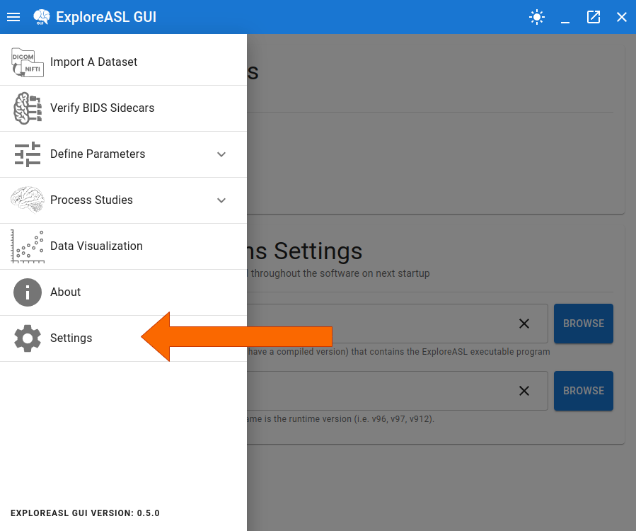
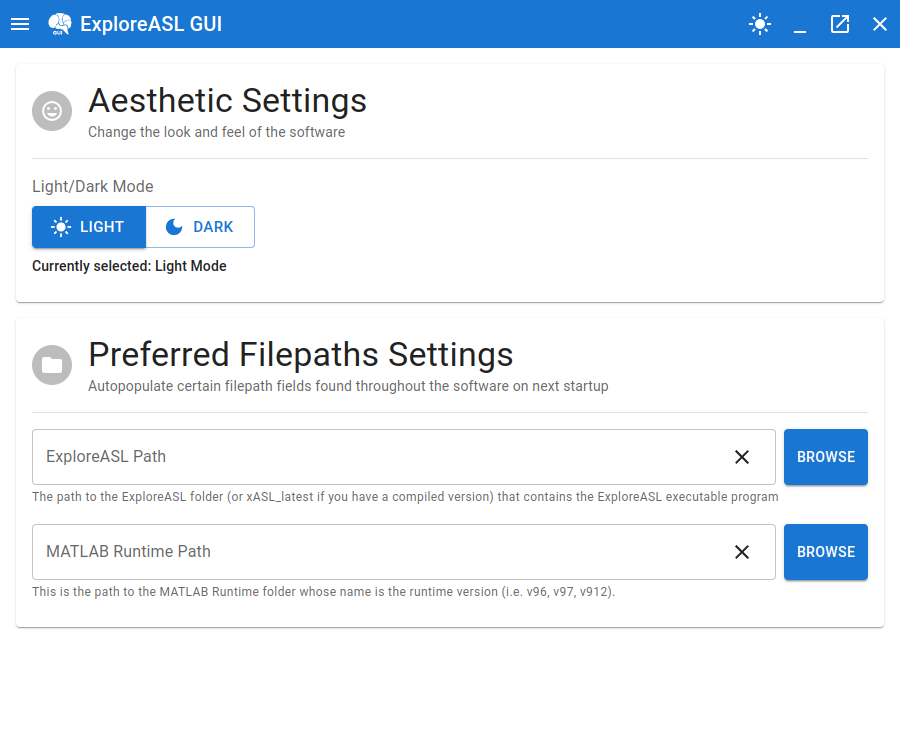

# Global Settings

The Settings page can be navigated to using the sidebar:

And after clicking the link, you will be presented with the following screen:

## Aesthetic Settings

These are settings which control the look and feel of the GUI. Currently there is only the option to change the light/dark theme of the GUI based on your preference.

## Preferred Filepaths Settings

Throughout the GUI, there are places that may require you to select a filepath that is used over and over (i.e. used during the import process and then used when defining the DataPar.json file). 

To make this process easier, you can set a preferred filepath for each of these locations. This filepath value will then be automatically filled in those locations the next time you start up the GUI and visit those locations.