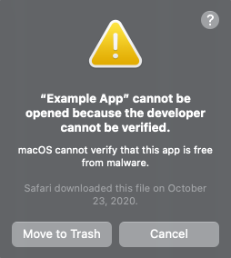
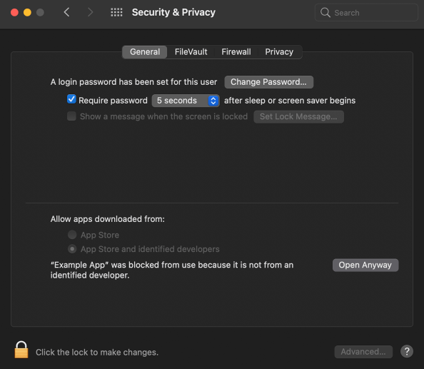
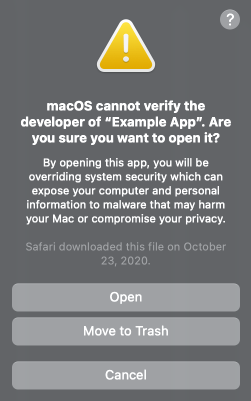
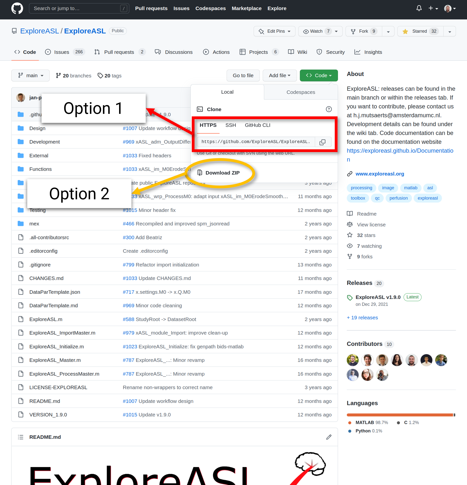

# User Installation and Uninstallation

---

There are essentially 3 components required for ASL Analysis using this software:

- The graphical user interface (GUI) software itself (this program)
- An ExploreASL version (compiled or from GitHub)
- A MATLAB version (regular or MATLAB Runtime)

:information_source: If there is considerable interest/requests for supporting the Dockerized version of ExploreASL, the feature can be added in the future.

---

## GUI

Simple enough, head on over to the [**Releases**](https://github.com/MauricePasternak/ExploreASL-GUI/releases) page on the GitHub repository of this GUI and download the version of your preference. The latest version is recommended.

### [![windows-shield]][windows-url]

#### Installing on Windows

Windows user can simply run the `ExploreASL-GUI-x.x.x Setup.exe` installer. The application will automatically be installated in your AppData folder, a shortcut will be created on your desktop, and the application itself will auto-launch at the end.

#### Uninstalling on Windows

You can uninstall the application by going to `Control Panel` :arrow_right: `Programs` :arrow_right: `Programs and Features` and selecting `ExploreASL-GUI` from the list of installed programs. Click `Uninstall` and follow the prompts.

### [![macos-shield]][macos-url]

#### Installing on MacOS

MacOS users can simply double click the `ExploreASL-GUI-x.x.x.dmg` file. They will be prompted with a small window showcasing a drag operation of the software into their `Applications` folder. Once this is done, the application should be lauchable from the `Applications` folder.

:warning: You may be prompted with a warning similar to the following:



There will be no option to open the application. `Cancel` for now.

To clarify, this message appears because the software has not **yet** undergone the signing process for being able to host on the MacOS App Store. To allow the program to run, you will need to go to `System Preferences` :arrow_right: `Security & Privacy` :arrow_right: click on the `General` tab :arrow_right: click the `Open Anyway` button that should be featured near the bottom right of the window panel.



The next time you launch the application and receive the same note as above, you should also see an `Open` option this time. 



When you click this, the application will launch. Don't worry, you will only need to do this once, as the application will be added to the list of authorized applications.

#### Uninstalling on MacOS

You can simply drag the application from the `Applications` folder to the trash.

### [![linux-shield]][linux-url]

#### Installing on Ubuntu-Linux

After downloading the `exploreasl-gui-x.x.x.deb` file, open a terminal, navigate to the directory where the file is located, and run the following command:

```bash
sudo apt install ./exploreasl-gui-x.x.x.deb
```

Where `x.x.x` is the version number of the software.

Wait for a second or two. The application should now be installed and lauchable by pressing the Super key (Windows key) and typing the start of the software's name. 


You can also add the application to your dock by right clicking on the application icon and selecting `Add to Favorites`.

#### Uninstalling on Ubuntu-Linux

You can uninstall the application by running the following command in a terminal:

```bash
sudo apt remove exploreasl-gui
```

---

## ExploreASL

There are 2 versions of ExploreASL available:

- From GitHub
- Compiled

These will be referenced regularly within the GUI itself, so be sure to know which one you're using.

### From GitHub

Getting the GitHub one is straight forward. Head on over to the [**ExploreASL repository**](https://github.com/ExploreASL/ExploreASL) and either use the `git` command line tool to clone the repository via command:

```bash
git clone https://github.com/ExploreASL/ExploreASL.git
```

Or download the repository as a ZIP file by clicking the green `Code` button and selecting `Download ZIP`.



### Compiled

Getting the compiled version is not as straight forward. You will need to contact the <a href="mailto:ExploreASL.LAB@gmail.com" target="_blank">ExploreASL team</a> and request a copy of the compiled version. Be sure to take note which MATLAB version was used to create this compiled package.

---

## MATLAB 

[![matlab-shield]][matlab-url]

There are 2 versions of MATLAB available:

- Regular
- MATLAB Runtime

### Regular MATLAB

This is a requirement if you are using **the GitHub version** of ExploreASL. You can download the latest version of MATLAB from the [**MathWorks website**](https://www.mathworks.com/products/matlab.html).

### MATLAB Runtime

This is a requirement if you are using **the compiled version** of ExploreASL. You can download MATLAB Runtime from the [**MathWorks website**](https://www.mathworks.com/products/compiler/matlab-runtime.html). Be sure to download the version that matches the version of MATLAB that was used to compile the ExploreASL package.


<!-- MARKDOWN LINKS -->
[windows-shield]: https://img.shields.io/badge/Windows-10+-blue?style=for-the-badge&logo=windows
[windows-url]: https://www.microsoft.com/en-us/windows
[macos-shield]: https://img.shields.io/badge/macOS-10.15+-blue?style=for-the-badge&logo=apple
[macos-url]: https://www.apple.com/macos
[linux-shield]: https://img.shields.io/badge/Linux-Ubuntu_20.04+-blue?style=for-the-badge&logo=linux
[linux-url]: https://ubuntu.com
[matlab-shield]: https://img.shields.io/badge/MATLAB-R2019a+-blue?style=for-the-badge&logo=matlab
[matlab-url]: https://www.mathworks.com/products/matlab.html