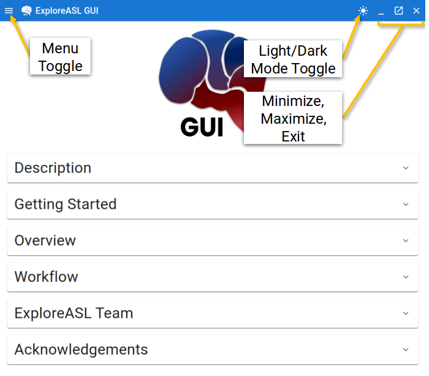

# Starting Page

---

## Overview

When you start up ExploreASL-GUI, you will be greeted with the following screen:

This is the About Page. It contains information about the program, some rephrasing of what is mentioned in this documentation, links and contacts, etc.

## Toolbar

The toolbar is located at the top of the GUI. It contains the following buttons:

For a more modern look, you can toggle a dark theme to keep the GUI in sync with your operating system. When you restart the GUI, this choice will be remembered.

Agnostic to operating system, the GUI's window controls (minimize, maximize, close) are located in the top right corner of the GUI. Apologies to the MacOS users for whom this is a deal-breaker.

And finally, to navigate to the different pages of the GUI, there is a menu/navigation toggle located in the top left corner of the GUI.

## Navigation

Toggling the navigation menu will open a sidebar drawer that contains links to the different pages of the GUI:

Each link corresponds to a different section/focus of the GUI. In a nutshell:

- **`Import a Dataset`**, for importing your data from DICOMs to NIfTI files
- **`Verify BIDS Sidecars`**, which serves two purposes:
    1. To verify that your data is in BIDS format. Error feedback is provided for any non-compliant files & fields.
    2. To allow for fine-tuned editing of your BIDS sidecars at the individual scan level. This can be desirable in the event that you want to change the parameters of a particular scan (i.e. add a scaling factor to undo a scaling issue you're aware of that was applied during the scan), or if you want to fill in data that could not be automatically extracted from the DICOMs during the import process.
- **`Define Parameters`**, for defining the plethora of parameters that ExploreASL uses to process your data
- **`Process Studies`**, for analyzing your imported and adjusted data in a multiprocessing fashion
- **`Data Visualization`**, for visualizing your processed ASL dataset in combination with your own metadata (i.e. demographics, clinical data, etc.)

With all of this in mind, let's proceed to import our data into NIftI format by toggling the navigation menu and clicking on `Import A Dataset`.