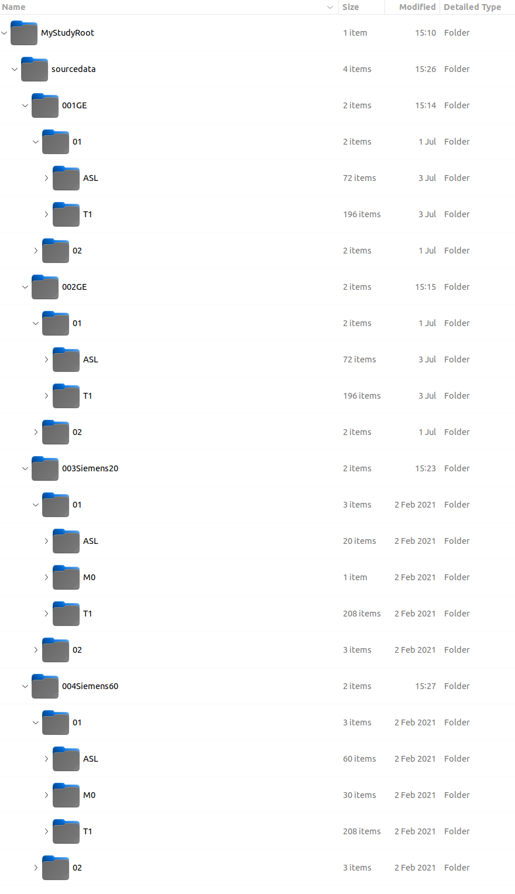

# Preface

---

For this tutorial, it is assumed you have:

- Met the [requirements](../../Requirements.md) for running the software
- Have [installed](../../Installation/Users.md) the software as well as its MATLAB and ExploreASL dependencies

## Example Dataset Introduction

Throughout this tutorial, we will be using the following dataset as an example:

If you've done your homework, this should look like the start of a BIDS dataset. If not, please familizarize yourself with the [BIDS specification](https://bids-specification.readthedocs.io/en/stable/).

Throughout the GUI, there will be requests to provide a **"Study Root Directory"**. In this example, this would be the folder called **`MyStudyRoot`**. This is the folder that, itself, will contain the BIDS-compliant subfolders:

- **`sourcedata`**; where your raw DICOMs are stored
- **`rawdata`**; where your DICOMs are converted to NIfTI files
- **`derivatives`**; where the ASL processing is performed

For your own project, you will want to ensure that, at the very least, you have a **`sourcedata`** folder located under your own **Study Root Directory**.

Also, take note at the consistency of the folder structure that comes after **`sourcedata`**. This is a requirement for the GUI to be able to properly import your data from DICOMs to NIfTI files. This will be covered in further detail in the "[Define Filepaths and Folder Structure](../1_Import/1_Defining_Folder_Structure.md)" section of this tutorial.

For now, just take note that the level after **`sourcedata`** features folders corresponding to individual subject. In fact, there are three different ways that these subjects were acquired which leads to the different naming suffix here:

- `001GE` and `002GE` were subjects whose scans were performed on a GE scanner with a 3D Spiral sequence and PCASL labeling.
- `003Siemens20` was scanned on a Siemens scanner with 3D GRASE sequence and PASL labeling, and output as 20 DICOMs representing 10 control & label pairs.
- `004Siemens60` was acquired on a Siemens with PASL labeling, and output as 60 DICOMs representing an averaged control & label pair.

Inside each of these subject folders, there are two subfolders:

- `01`, representing scans from the baseline visit
- `02`, representing scans from the follow-up visit

Finally, inside these visit folders are the scan folders:

- `ASL`, containing the ASL data (or possibly an embedded M0 scan within, as is the case for the GE data here)
- `T1`, containing the T1-weighted structural data
- `M0`, for the proton density weighted image needed for normalizing perfusion weighted images into absolute units

**:information_source: Note:** These visit and scan folder names are not absolutely necessary. They could have been called "FOO", "BAR", etc. As long as the folder names are consistent, you will be able to instruct the ExploreASL-GUI on the meaning behind each folder.