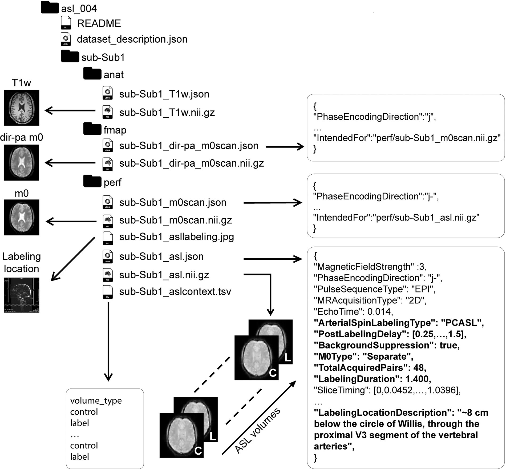

# Import Module Overview

--------------------------------------------------------------------------------

In this tutorial, we will be importing our dataset's DICOMs into NIfTI files. This is a necessary prerequisite for the rest of the pipeline.

## Purpose of this Module

The output of MRI scanners differs between scanner models, software upgrades, site-specific preferences, the nature of anonymization algorithms, etc. This complicates the ability to share data between sites and researchers, or even to analyze a dataset featuring a variety of acquisitions. The necessity for this stems from the consensus of using NIfTI files as the standard format for neuroimaging data analysis by the scientific community.

||
|:--:|
|BIDS output example for a single subject. Taken from Clement, Patricia & Castellaro, et al. (2022). ASL-BIDS, the brain imaging data structure extension for arterial spin labeling. Scientific Data. 9. 10.1038/s41597-022-01615-9. |

There have been several excellent tools developed for this purpose, such as [dcm2niix](https://github.com/rordenlab/dcm2niix), [dcm2bids](https://github.com/UNFmontreal/Dcm2Bids/issues), among others. Unfortunately, these tools have one or more of the following caveats:

- they are not fully automated and/or their output must then be manually curated by the user, a process which is prone to error itself
- they require a significant degree of programming knowledge to use
- they are not sensitive to very particular flavors of ASL data which contain parameters vital to CBF quantification in obscure & private DICOM headers. ASL-BIDS is a relatively newer extension to the BIDS specification, and thus some of these tools have not yet been updated to support it

This module avoids all these caveats and allows you to specify the meanings of folders found in your dataset and then executing the import process in a fully automated fashion. The single drawback is that the folder structure found in `sourcedata` must follow certain reasonable rules in order for the import to work properly. This will be covered in the next section.

