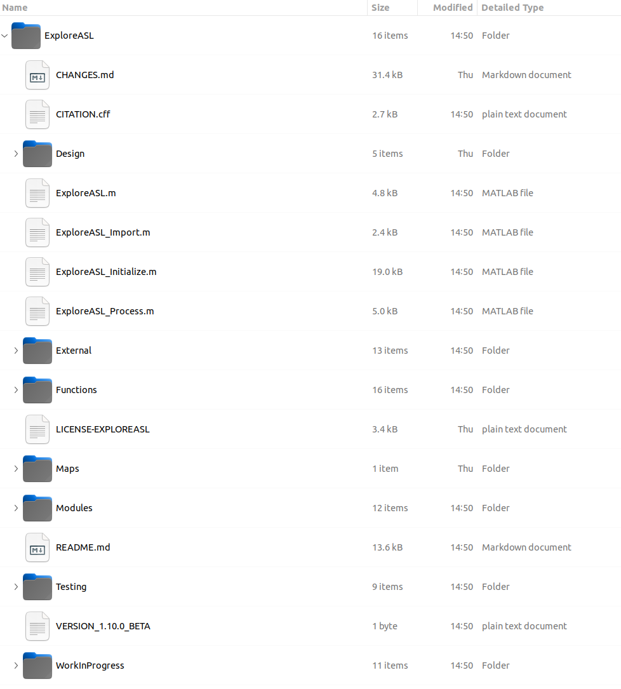
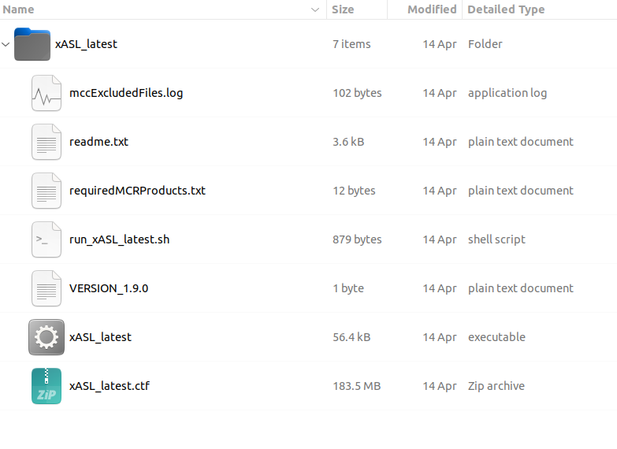
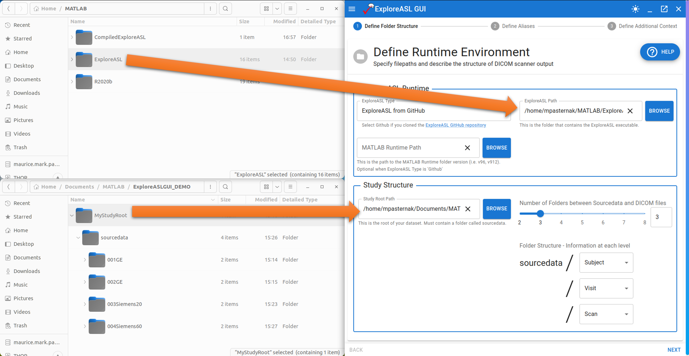
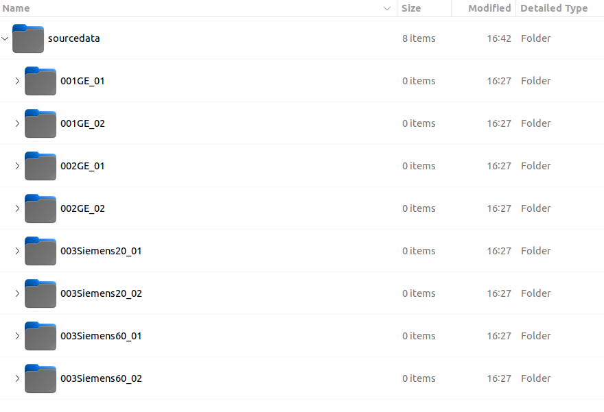
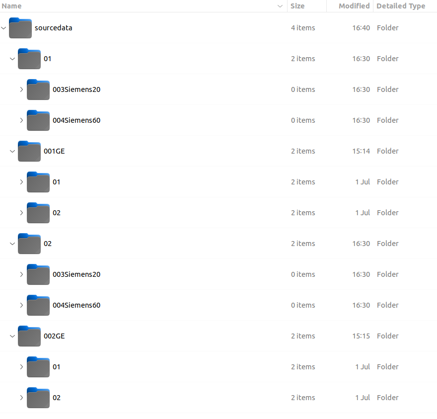
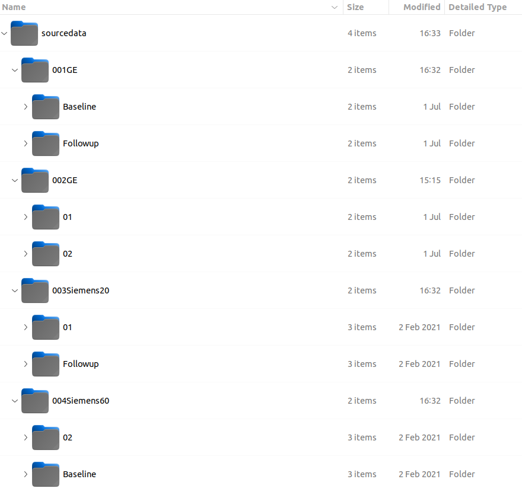
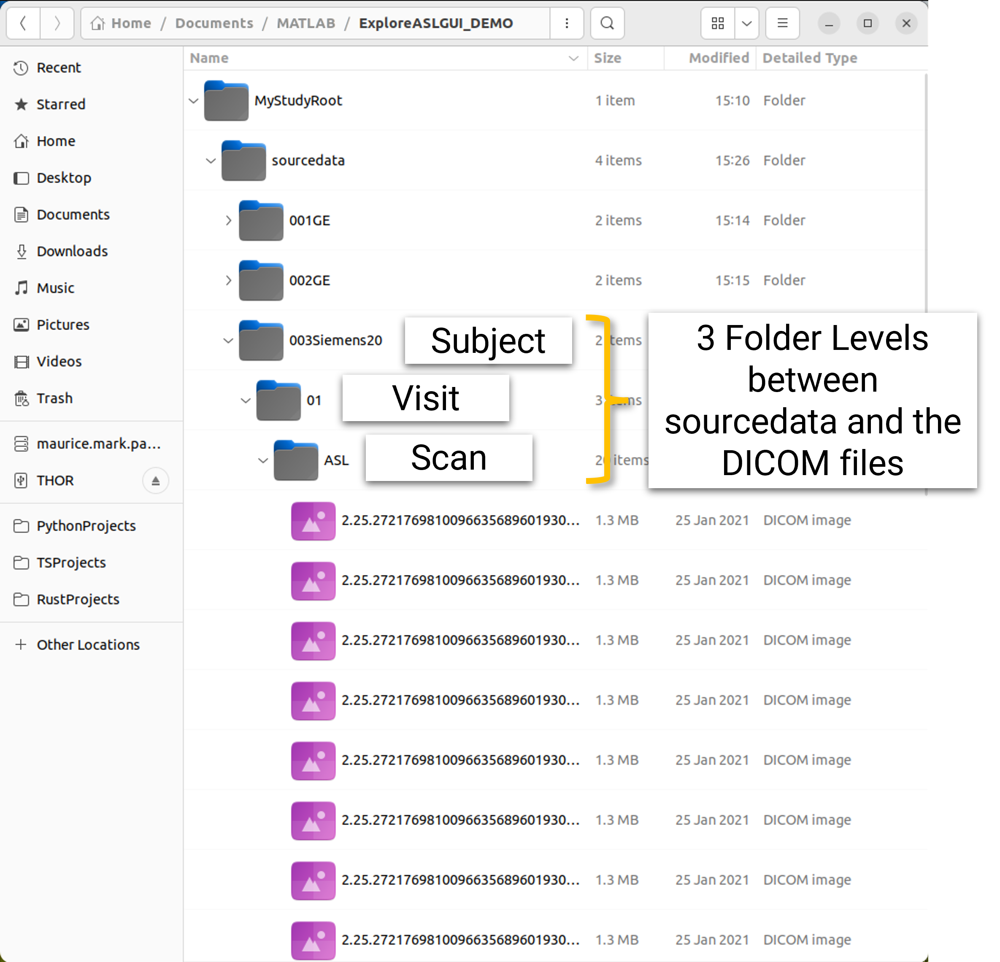
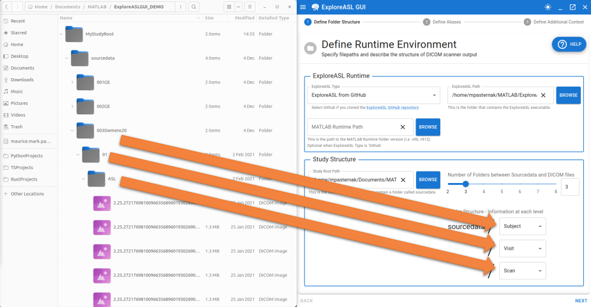

# Defining Filepaths and Folder Structure

---

## ExploreASL and MATLAB Paths

The import process requires knowledge about the underlying ExploreASL program and MATLAB. You will have to indicate:

- `ExploreASL Type`: whether you are using the GitHub version or the compiled version of ExploreASL.
- `ExploreASL Path`: the path to the ExploreASL main folder, which should be either called `ExploreASL` or `xASL-latest` for the GitHub and compiled versions, respectively.
- `MATLAB Runtime Path`: the path to the MATLAB Runtime folder, which should have a folder name along the lines of `v96`, `v97`, etc. This is only required if you are using the compiled version of ExploreASL.

For clarification, here is what the structure of the ExploreASL from GitHub should look like:

And where is what the `xASL-latest` folder should look like for the compiled version of ExploreASL:

## Folder Structure

Before we discuss the folder structure, let's first fill in the `Study Root Directory` field. Recall that this is the folder that will contain the BIDS-compliant subfolders:

- `sourcedata`
- `rawdata`
- `derivatives`

### Proper Folder Structure

Recall that the [overview for this section](./0_Overview.md) mentioned that the GUI requires that your DICOM folder structure follow certain rules. They are as follows:

1.  #### **Compartmentalization**: 

    Every child, grandchild, etc. of the `sourcedata` folder must only contain **1 piece of information**. A piece of information is one of the following:
    
    - A subject's designation
    - A visit's designation
    - A session's designation
    - A scan's designation

    The following is an example of where this rule is violated:

    

    The issue here is that child folders of `sourcedata` have 2 pieces of information: the subject label and the visit label. This is the most common incompatibility your dataset may have with the import process. In the above example, the solution would be to move the visit label to the grandchild level.

2. #### **Consistent Ordering**: 
    
    The same piece of information must always be found in the Nth depth down from `sourcedata`. Fortunately, this rule is very difficult to violate, as the output of MRI scanners generally follows a consistent ordering.

    The following is an example of where this rule is violated:

    

    The issue here is that in some cases, a subject is found as the grandchild of `sourcedata`, while in other cases, a subject is found as a direct child of `sourcedata`. Same goes for the visit designations.

3. #### **Consistent Naming**: 

    For visits and scans, the same piece of text should describe that temporal aspect of the data. For example, if a baseline visit is called "Baseline" for one subject, it should be called "Baseline" for all subjects.

    The following is an example of where this rule is violated:

    

    The issue here is that there is a back-and-forth between using the numerical designation of Baseline and Followup versus the explicit text representation of those visit names. Again, this tends to be an uncommon issues, but may be present in datasets where site-specific naming conventions are used. Some folder renaming may be required to fix this issue in such an event.

### Specifying the Folder Structure

Now that we have discussed the rules for the folder structure, let's discuss how to specify the folder structure in the GUI. The GUI will request two pieces of information:

1. The number of folder levels that are between `sourcedata` and the DICOM files. If we look into our project folder, we can see that there are 3 levels between `sourcedata` and the DICOM files:

    

    Therefore, we will enter `3` into the `Number of levels between sourcedata and DICOM files` field.

2. The piece of information is found at each directory level. There are 5 options available:
    - `Subject`
    - `Visit`
    - `Session` (sometimes called "Run" in literature)
    - `Scan`
    - `Ignore`

    That last option is for folder levels that do not offer any valuable information. For example, some scanners typically output a folder called `DICOM` that contains either additional folders or the DICOM files themselves. This folder in an of itself is not useful for the import process, so we can ignore it.

    

    **:information_source: Note:** At minimum, a dataset is reasonably expected to have a level of folders dedicated to subject names and a level of folders dedicated to scan names. Please consult your project's data manager if this requirement is somehow not met.

At this point, no validation errors should be present. We can proceed to the next step by clicking the `Next` button located in the bottom right of the program.