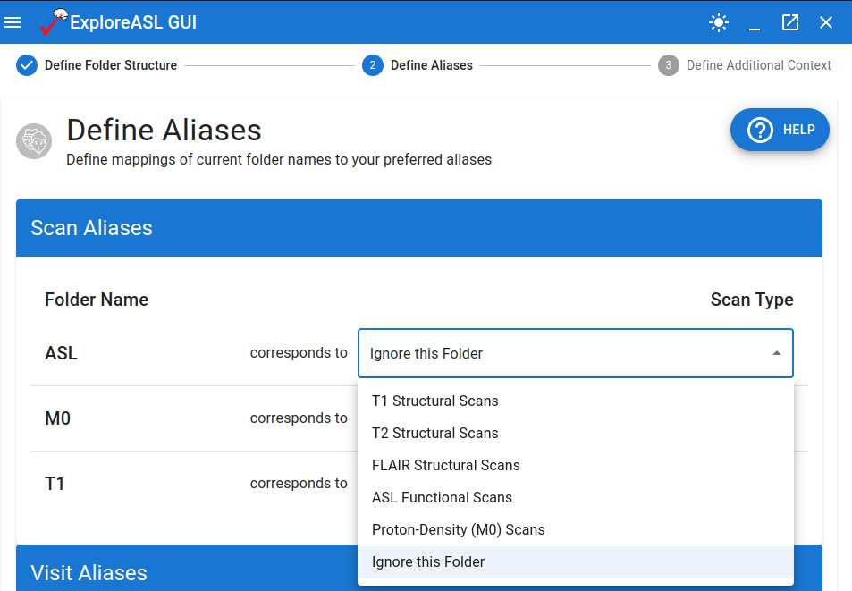
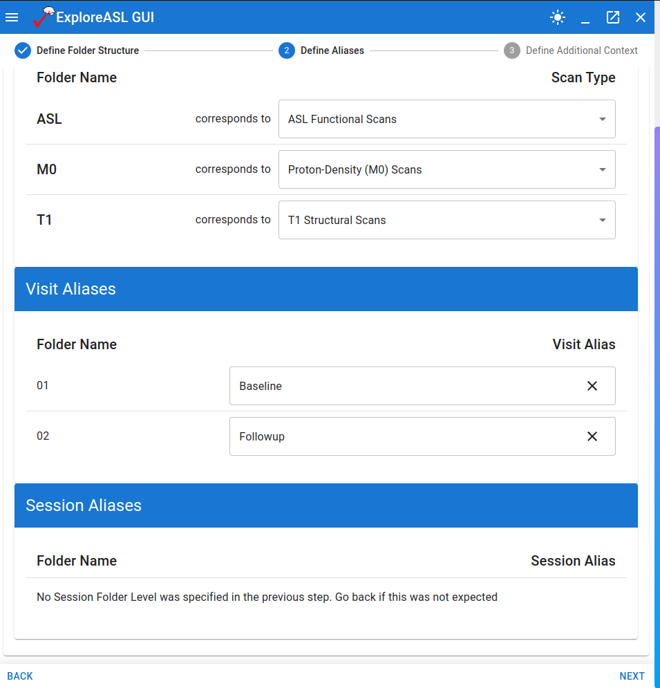

# Defining Aliases

---

Once the software is aware of the general folder structure found in `sourcedata`, it is necessary to help it understand the meaning behind the folder names. Specifically: 

1. Which scan folders hold what kind of MRI scan. Our example may have convenient names for scans like "ASL" or "T1", but this is not always the case. Sometimes it may be a random set of characters output by the MRI scanner.

2. Whether there are any difficult-to-understand folder names that should be represented in a more human-readable format (i.e. digits representing baseline, followup, etc.).

## Defining Aliases for Scans

The first issues is tackled when we define aliases for scans. In the earlier step, when we specified which folder depth had scan information, the program has now gathered the folder names present at that level so that we can define the meaning behind them. The options are as follows:

- `Ignore this Folder`: This option is useful for discarding additional fluff output by the scanner that happens to be present at the same level as the scans.
- `T1 Structural Scans`
- `T2 Structural Scans`
- `FLAIR Structural Scans`
- `ASL Functional Scans`
- `Proton-Density (M0) Scans`

In our example, the mapping is obvious. Again, this is not always the case.

## Defining Aliases for Visits and Sessions

The second issue is tackled by defining aliases for visits and sessions. The same logic applies as for scans: from our earlier step, the program understands the names of folders found at a certain depth away from `sourcedata`. Now it is asking the question "would you like this to be called something else when its imported?".

In our example, this would be advantageous. The folder names of 01 and 02 are not very descriptive of their meaning (i.e. that one is a baseline scan and the other is a followup). Therefore we can specify that these should be called "Baseline" and "Followup" respectively.

You can also see that when a particular piece of information is absent (in our example, Session/Run information), a default description is placed in the position where a mapping input would be.

We can proceed to the penultimate step of the import pipeline.