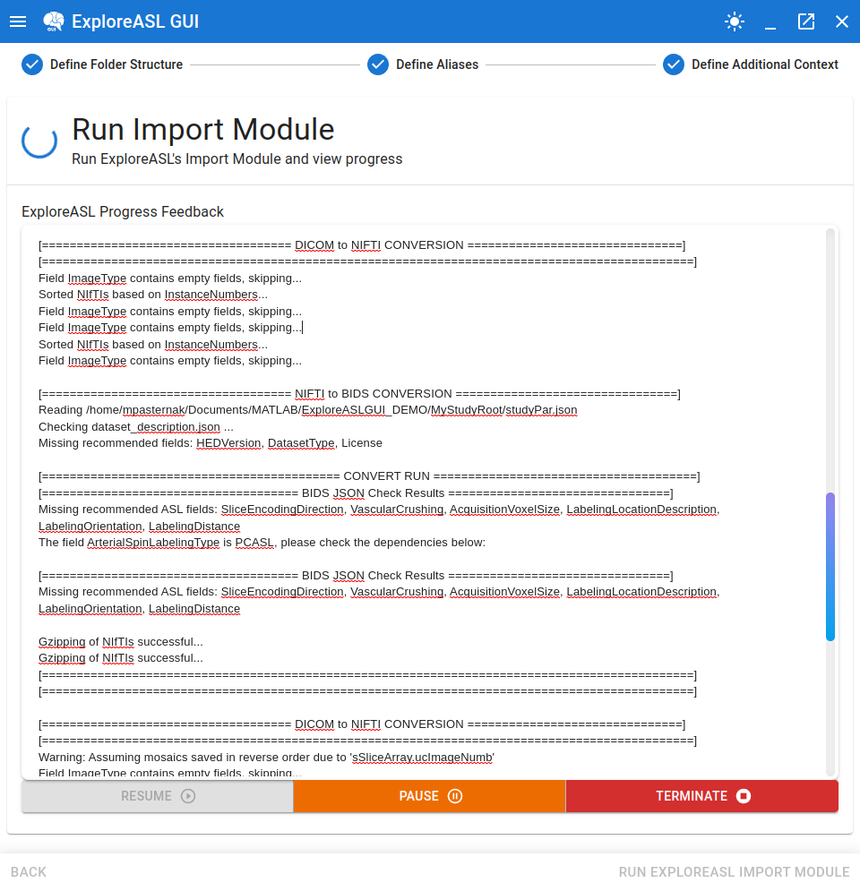

# Running the ExploreASL Import Module

---

## Starting the Import

Running the import is relatively straightforward. Simply click `Run ExploreASL Import Module` in the bottom right corner of the GUI to start the import process. The GUI will then look like this:

As seen in the image above, there are controls present for the pausing, resuming, and terminating of an import process in the event that the user's workstation's resources need to be freed up.

## Import Process Finishes

When complete, you will receive a message to take a look at the generated `rawdata` and `derivatives` folders, in particular the log files from the ExploreASL process, in order to verify that all expected images were imported over. In a future update, this part will be more automated to give better feedback regarding import errors, if any occurred.

We now have a BIDS-compliant dataset:

---

**:information_source: Note:** Due to factors such as anonymization, the import process may have completed largely successfully (i.e. all image were converted and relocated to BIDS-compliant locations), but there may be some issues left over with the BIDS sidecars that could not gather all the necessary information or the DICOM data present was, somehow, invalid itself.

Therefore, in the interest of ensuring that the import was valid, in the next step we will be validating the BIDS sidecars that were generated during the import process. To proceed, toggle the navigation menu and select `Verify BIDS Sidecars`.