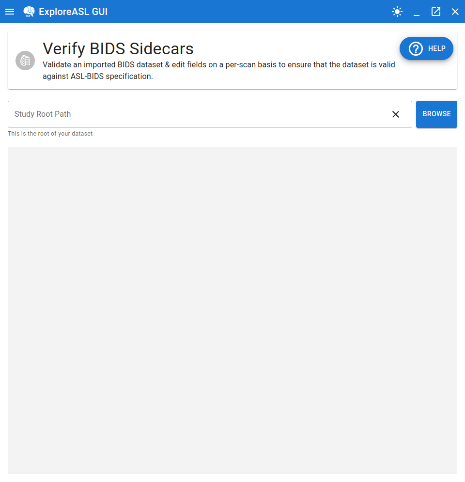

# Overview of Editing BIDS Sidecars

---

## Purpose of this Module

It should be noted that this entire module is **optional, yet recommended**. As mentioned at the end of [the previous section](../1_Import/4_Running_Exploreasl_Import.md#import-process-finishes), the import process is designed to be as robust as possible, but it is not perfect. Most commonly, a anonymization process used by a site may have been excessive to the degree where important information that is required for the processing of the data could not be found in the import procedure. This module provides feedback as to the integrity of the imported dataset and allows for user editing/removal of BIDS fields and individual values, while ensuring that the user is made aware of how BIDS compliant or non-compliant the data is.

## Navigating to the Module

To navigate to this module, toggle the navigation menu and select `Verify BIDS Sidecars`. You will then be greeted with the following screen:

