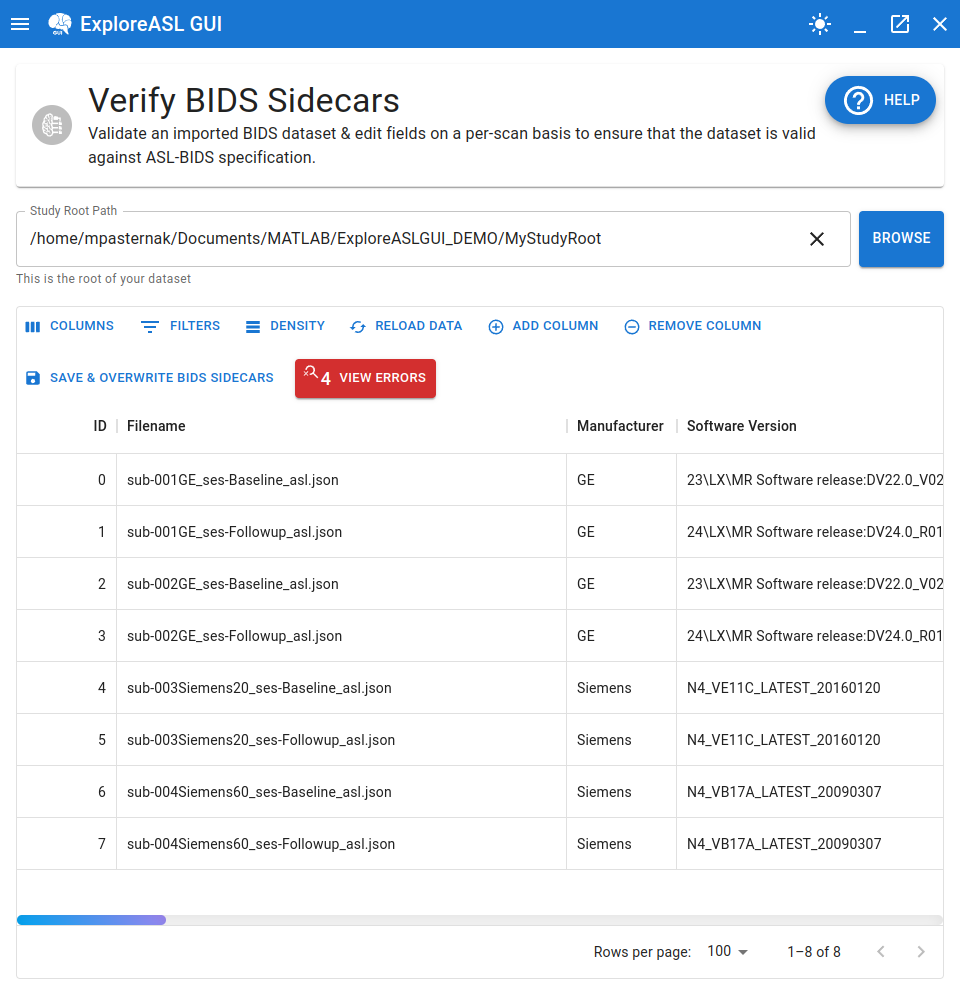

# Loading a Study

---

Loading in a study is as simple as specifying the path to the study's root directory. The program will then automatically detect the BIDS structure of the study and load all the relevant information to be presented in spreadsheet form:

The errors may be ignored for now (as they are deliberate in this tutorial). They will be discussed very shortly!

## What is loaded in?

At minimum, the spreadsheet will always contain the following two columns:

- `ID`: This is the spreadsheet's index ID. It is used to keep track of the row's position in the spreadsheet. If errors show up, feedback will contain reference to this field in order to help the user navigate to the problematic row.
- `Filename`: This is the name of the ASL BIDS sidecar that a particular row corresponds to.

These two columns are essential to the functionality of the spreadsheet and thus cannot be modified or removed.

The rest of the columns are automatically generated based on the information present in the BIDS sidecars. The following is a list of all the columns that can be generated:

Note that the names presented here are [**BIDS names**](https://bids-specification.readthedocs.io/en/stable/glossary.html). The spreadsheet will display the names in a more user-friendly format. 

- **Numeric Fields**
	- `BackgroundSuppressionNumberPulses`
	- `BolusCutOffDelayTime`
	- `EchoTime`
	- `FlipAngle`
	- `InversionTime`
	- `LabelingDuration`
	- `MagneticFieldStrength`
	- `M0Estimate`
	- `M0_GMScaleFactor`
	- `PostLabelingDelay`
	- `RepetitionTimePreparation`
	- `TotalAcquiredPairs`
	- `TotalReadoutTime`
- **Text Fields**
	- `PulseSequenceDetails`
	- `ReceiveCoilName`
	- `ScanningSequence`
	- `SequenceName`
	- `SequenceVariant`
	- `SoftwareVersions`
- **Enum Fields**
	- `ArterialSpinLabelingType`
	- `BolusCutOffTechnique`
	- `CASLType`
	- `Manufacturer`
	- `M0Type`
	- `MRAcquisitionType`
	- `PASLType`
	- `PCASLType`
	- `PulseSequenceType`
	- `PhaseEncodingDirection`
	- `SliceEncodingDirection`
- **Boolean Fields**
	- `BackgroundSuppression`
	- `BolusCutOffFlag`
	- `SkullStripped`

In future updates for BIDS fields will be included (i.e. comma separated text fields for representing numeric arrays). However, for most cases, the above fields should be sufficient to use with ExploreASL.

## What can go wrong when loading in a study?

There are generally 3 sources of errors that can occur when loading in a study:

### 1. The JSON sidecar is corrupted or has a syntax error

This isn't a common reason, but it can happen for users who are not familiar with JSON syntax and start tweaking the sidecars manually (hence why this software, and this module in particular, should be used as a tool as a safer alternative :stuck_out_tongue_winking_eye:). Let's say we purposefully change the syntax of one of the files. Here's what happens:

The program will automatically avoid loading in the corrupted sidecar(s) and will indicate which files are responsible for the error. The other sidecars will still be loaded in.

### 2. A field within the sidecar has a value whose "type" is completely incompatible with the expected "type"

For those with zero programming experience, it may be interesting for you to know that the content of JSON files has generally 6 types of values:

- number
- string (regular text)
- boolean (true or false)
- null (an explicit declaration of the absence of a value)
- a collection of the above types (array)
- another mapping of field-value pairs (object)

BIDS sidecars are no exception to this, and certain BIDS fields are expected to have a specific type(s) of value(s). If this comes as a surprise, you can read more about it [in the BIDS documentation on the formats](https://bids-specification.readthedocs.io/en/stable/glossary.html#boolean-formats).

The spreadsheet also makes certain assumptions about the type of value for a given field (i.e. boolean for `BackgroundSuppression`, number for `MagneticFieldStrength`, etc.). If the value of a field is incompatible with the expected type, the program will throw an error and will not load in the sidecar(s) that are responsible for the error. Here's an example if we purposefully change the type of value for several fields in one of the sidecars:

Once again, an error message will be displayed with the name of the sidecar(s) that are responsible for the error. In addition, the exact erring field(s) will be summarized together with the nature of the error or feedback of what type was expected instead.

### 3. A field within the sidecar has a value that is of the correct "type" but is not BIDS compliant

Okay, we can revisit our example from earlier where we noticed that 4 errors were present in our dataset, as that is a good example of this type of error:

No explicit error message was displayed, as everything could be loaded in. However we do have feedback in the form of the `View Errors` button in the toolbar. Let's click on it:

How curious! It seems that the `Labeling Duration` field is not BIDS compliant in the for the latter 4 sidecars because they were the Siemens PASL acquisitions. Recall, Labeling Duration is not a field that should be present for PASL scans, which is exactly what the error message is telling us. This is further reinforced by moving to the indicated location in the spreadsheet:

And we see that the cells for these erroneous fields are highlighted in red. This is a feature that is present for all the fields that are not BIDS compliant.

From here, it depends on the nature of the error. Typically, the user will have to do one of two things:

- Edit the value of the field to make it BIDS compliant.
- Remove the field's value from the sidecar.

For this error, the latter is the correct course of action. Spoiler alert for future sections: to delete a cell, simply select it and press the `Delete` or `Del` key on your keyboard.

Okay, much better. We can now proceed to the next section to learn how to edit the values of the fields.