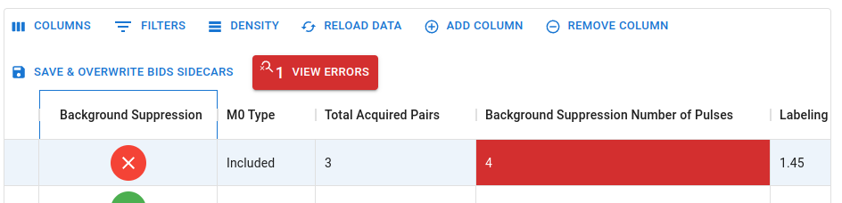
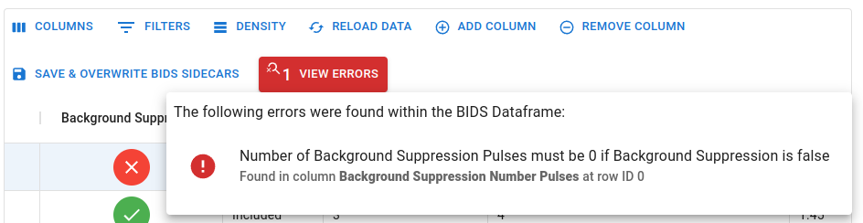

# Editing BIDS Values

---

## Editing

Like Excel, the spreadsheet allows you to edit the values of the cells. Simply double-click the cell of interest and an editor view of that cell will appear with the value focused. You can then edit the value within the confines of what is reasonably permitted for that cell. For example, you cannot enter a letter in a cell that is meant for numbers.

In general there are 4 types of editable fields in the spreadsheet:

- **Text**: These fields are meant for text values. They can be edited by simply typing in the value you want.
- **Numeric**: These fields are meant for numeric values. They can be edited either by typing in digits or by using the up/down arrows on the right side of the cell.
- **Enum**: These fields are meant for values that are restricted to a finite set of options. They can be edited clicking on the cell and selecting the value you want from the dropdown menu that appears.
- **Boolean**: These fields are meant for values that are restricted to `true` or `false`. They can be edited by clicking on the cell and toggling the value between `true` (represented by a checkmark) and `false` (represented by an x).

Once you are done editing the value, press `Enter` to save the changes or click elsewhere to have the cell lose focus and auto-submit its value.

**:information_source: NOTE**: This spreadsheet was programmed with the assumption that the datasets may be significant. To preserve some performance, a small (~300-400ms) delay is unfortunately [and necessarily] present between the moment you stop typing to the moment the value is communicable to the underlying logic (i.e. BIDS validation is occurring). Pressing `Enter` too quickly after typing will result in the value not being submitted. The delay isn't noticeable in most cases, but if you are experiencing this issue, try waiting a bit longer before pressing `Enter`. 

## Deleting

To purge a value from a cell, select the value and press `Delete` on your keyboard. This is very different from actions like editing the value of a numeric field to be zero. In that case, the value is still present, but is simply set to zero. Deleting the value will remove it from the spreadsheet (and thus from the BIDS sidecar if you save the spreadsheet). 

As seen in the [previous section](./1_Load_A_Study.md#3-a-field-within-the-sidecar-has-a-value-that-is-of-the-correct-type-but-is-not-bids-compliant) this is a useful action to take for fields that are present for some sidecars but need to be absent for others.

**:information_source: NOTE**: For those unsure, the `Delete` key is the key with the `Del` label on it. It is **not** the `Backspace` key.

## Making Mistakes

Of course, even within the confines of what is reasonably permitted for a cell, you can still make mistakes that will invalidate the integrity of the data in terms of BIDS specifications. 

As seen in the [previous section](./1_Load_A_Study.md#3-a-field-within-the-sidecar-has-a-value-that-is-of-the-correct-type-but-is-not-bids-compliant), erroneous values are automatically highlighted in red and can be located (for large datasets) by referring to the `View Errors` button in the toolbar.

For example, let's change the `Background Suppression` field from `True` to `False` for one of the GE scans:

As expected, `Background Suppression Number of Pulses` is now invalid, as it has a non-zero value when `Background Suppression` is set to `False`.

While this example can be deduced logically even without needing to check the toolbar button for more information, there are several instances where the nature of the error is not immediately obvious. Regardless, clicking on the `View Errors` button will open a popover window that will list all the errors in the spreadsheet, their locations, and a succint description of the error in a human-readable format:

