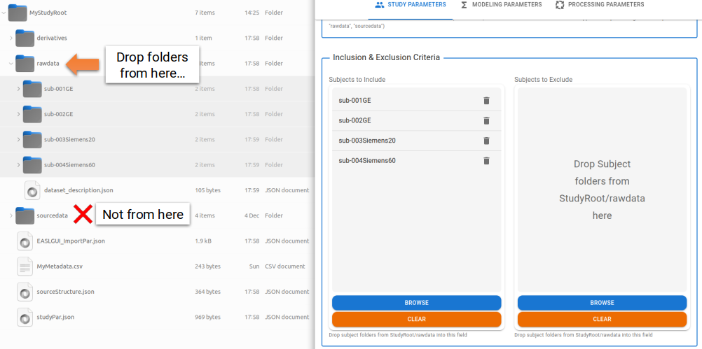

# Study Parameters

---

This section of the module general covers filepaths and subject selection for ExploreASL to be able to perform as needed.

## ExploreASL and Study-Specific Parameters

Similar to the steps performed in the [Import Module](../1_Import/1_Defining_Folder_Structure.md), defining the type of ExploreASL installation, its location, and (if applicable) the location of the MATLAB Runtime installation are all required files.

Furthermore, the location of the root folder of the study is also required. For controlling the name of the study in reports generated by ExploreASL, you can specify the optional `Study Name` field in this section.

For more information on the types of ExploreASL installations refer to the section where the structures of these are explained in the [Import Module](../1_Import/1_Defining_Folder_Structure.md#exploreasl-and-matlab-paths).

## Subject Selection and Exclusion

It is possible to want to only process a subset of subjects while excluding others despite all having been imported into BIDS format. For example, you may wish to exclude subjects for a re-analysis with bad quality data removed, as identified when we look interactively in the [Data Visualization](../5_DataViz/3_Plot_Overview.md) section.

Two filepath dropzone fields are available for this purpose. One for explicit **inclusion** and the other for explicit **exclusion**.

:exclamation: **IMPORTANT NOTE** :exclamation: 

When specifying the subject folders for inclusion/exclusion, remember to make the selection come from the `rawdata` folder, **not** `sourcedata` or `derivatives`. Recall that the import process to BIDS format will have altered subject folder names (i.e. appended a `sub-` prefix, replaced characters like hyphens, etc.). 

