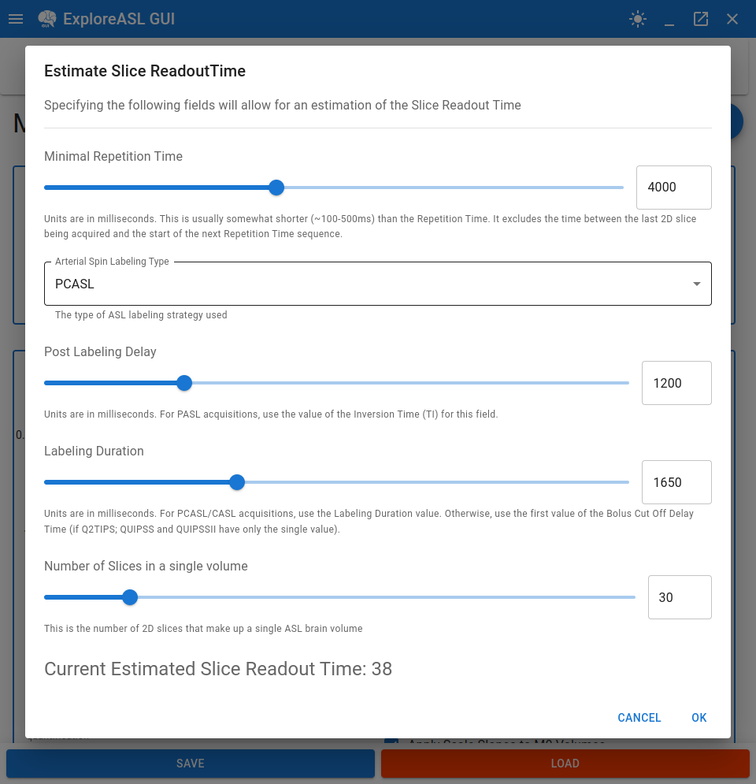
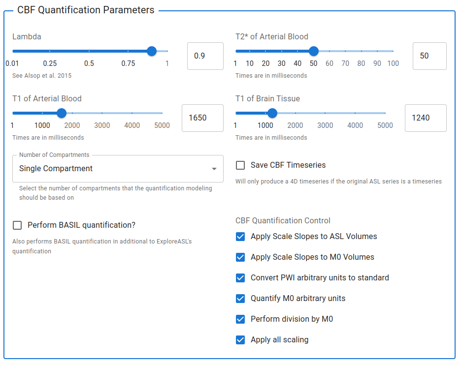

# Modeling Parameters

---

This portion of the module covers settings that are involved in the modeling of the ASL data for quantification.

## Additional ASL Acquisition Parameters

This section is responsible for specifying additional ASL acquisition parameters that, for various reasons, could not be implemented in the [Import Module](../1_Import/3_Defining_Contexts.md#additional-asl-information).

Currently, the only such parameter is Slice Readout Time, which is only required for 2D acquisitions. It is ExploreASL's term for the time between the acquisition of each 2D slice during the ASL acquisition.

It can either be specified directly using the input slider, or by clicking the `Help Me Calculate Slice Readout Time` button. If it is clicked, a dialog window will appear with inputs for the relevant parameters associated with calculating a Slice Readout Time value:

**:information_source: NOTE:** The slice readout time is expected to be a value between 0 and 100 milliseconds. Values outside this range will be rejected (the OK button will be disabled).

## CBF Quantification Parameters

This section is responsible for specifying the modeling and quantification parameters for extracting CBF values from the ASL data.

Please refer to the [ASL consensus paper](https://pubmed.ncbi.nlm.nih.gov/24715426/), for which the default values shown above are set from (assuming 3T strength acquisition) or the backend [ExploreASL documentation](https://exploreasl.github.io/Documentation/1.10.0beta/ProcessingParameters/#quantification-parameters) for more information on these parameters.
