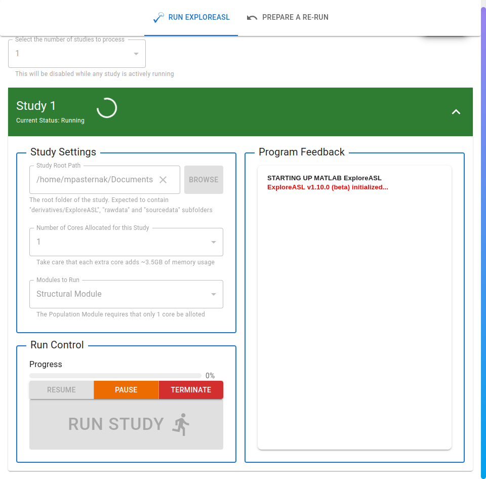
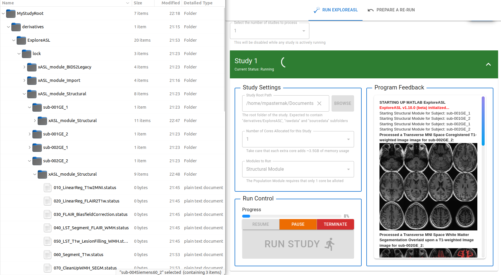
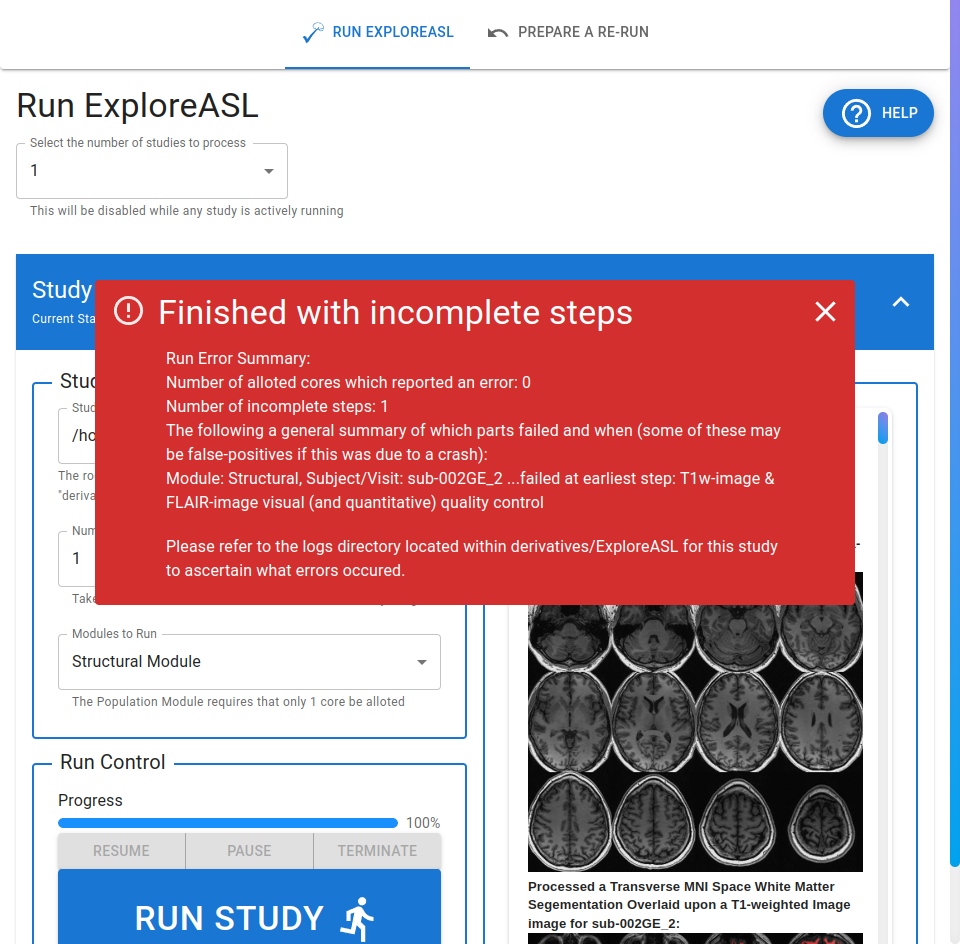

# Processing a Study

---

## Run Congifuration

Opening one of the "accordion" panels will reveal the following view:

As suggested by the headings, the panel is subdivided into 3 sections:

- `Study Settings`, where you can specify which study to process, how many resources (CPU cores) to allocate, and which ExploreASL module to run in the first place.
- `Run Control`, where you can initiate the processing of the study, pause it, resume from pause, or cancel it. This section also displays the current progress completion of the pipeline.
- `Progam Feedback`, much like in running the [Import Module](../1_Import/4_Running_Exploreasl_Import.md), feedback is given to the user as to the progress of the pipeline. Note that the feedback is more succinct, as the pipeline generates a lot of log statements that would otherwise clutter the program feedback panel. In addition, when certain quality-control steps complete, axial and coronal slices of the processed data are displayed in the panel as images.

## Study Settings

The fields in this section are as follows:

- `Study Root Path`: The root path of the study to process. This is the folder that contains the `dataPar.json` file generate in the previous module.
- `Number of Cores Allocated for this Study`: Self-explanatory. Note that certain numbers may be disabled if the program detects that another study already has a certain number of cores allocated to it.
- `Modules to Run`: The particular ExploreASL module to run. Options include:
  - `Strucural Module`
  - `ASL Module`
  - `Structural & ASL Module`
  - `Population Module`
  :exclamation: **NOTE** :exclamation: If selecting the lattermost, you may notice the run button is greyed out. This is probably due to the fact that only a **single core** can be allocated to running a Population Module.

## Running State

Once you have specified the study root path, the ExploreASL module to run, and have clicked `Run Study`, the panel will change to the following view:

At this point in time, you cannot alter the study configuration or change the number of studies to process. This is, again, for the sake of preventing over-extension of your workstations resources and to prevent the pipeline from crashing.

As the pipeline progresses, you will be able to observe that under the `derivatives/ExploreASL/lock` folder, there are folders and files being generated that correspond to the current state of the pipeline. As checkpoints are passed in the pipeline, certain `.status` files are created to indicate the passing of that checkpoint.

:warning: **Warning** :warning:

If you manipulate this lock structure or the `.status` files, you may cause errors in the pipeline. This is purely for your awareness and is not a feature that is intended to be used by the user.

## What if something went wrong during an earlier step?

Before running, the program re-validates the `dataPar.json` file and the `rawdata` folder in order to minimize the chance of a user-based error propagating into the analysis pipeline. If you attempt to run a study with an invalid setup, you will be greeted with an error message explaining the problem. For example, if we attempt to run the tampered `dataPar.json` file from the [DataPar Module](../3_DataPar/4_Saving_And_Loading.md#loading, we will be greeted with the following error message:

## Completing a Run

If a run is completed successfully, you will be greeted with the following message:

And you will be able to either start a new run on another module, or move onto [Data Visualization](../5_DataViz/0_Overview.md).

Alternatively, you may encounter an error during the run. If this is the case, you will be greeted with the following message:

As you can see, the error message features an overview of the number of steps that failed and a summary of the earlier step that failed for which subject/visit/session. From here, it is up to the user to review the log files found under `derivatives/ExploreASL/logs` detailing exactly what went wrong or to review their dataset to see if there are corrupt files or other issues that may have caused the pipeline to fail.

## Completing a Study Analysis

A study is considered analyzed when all 3 modules (Structural, ASL, Population) have been successfully completed. It is not possible to perform the next module, Data Visualization, for a particular study until all 3 modules have been completed.
