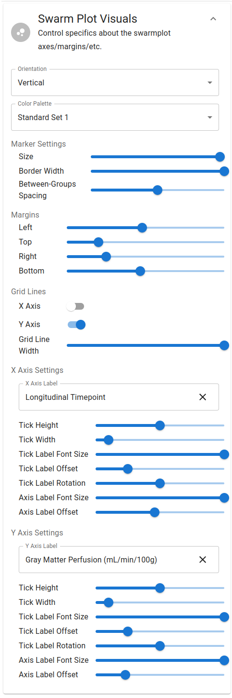
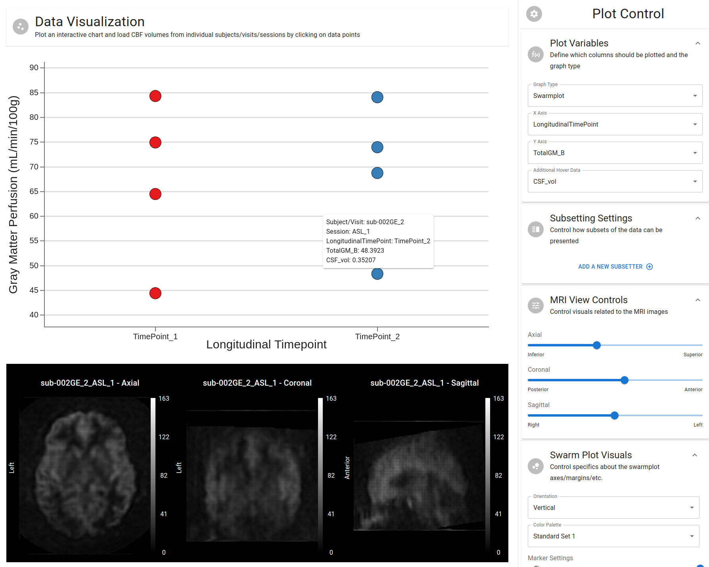

# Swarmplot

---

In general, swarmplots are used to visualize the distribution of a continuous variable across a categorical variable.

## Swarmplot Visuals

In general, the same settings are available for swarmplots as for scatterplots. The primary differences lie in a few additional marker settings:

- Border Width: The width of the border around each data point
- Between-Groups Spacing: The spacing between each level of the categorical variable plotted on the x-axis

## Swarmplot Prettified

The following is an example of a swarmplot with the adjusted display settings:

