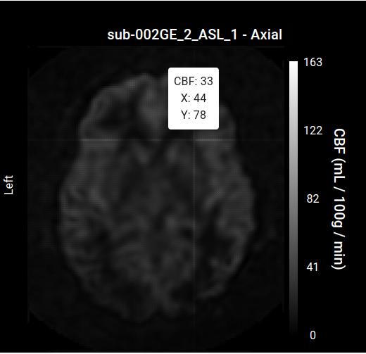
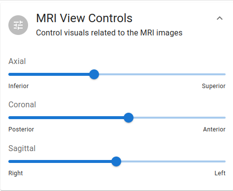

# Interactive MRI View

---

As mentioned in the module's overview, clicking interactively with the plot's data points will load in the corresponding perfusion MRI volume for that data point.

Do take note that clicking on several datapoints in quick succession (i.e. <2-3 seconds apart) will consume a lot of memory, so it is recommended to space clicks apart liberally. This is usually the case anyways, as you will likely want to inspect the MRI volume throughout in order to verify the absence of artifacts, distortions, vascular effects, etc.

This MRI view is itself interactive, such that hovering over particular voxels will display the corresponding perfusion values and x/y location within the plane.

Of course, the MRI view is not restricted to one plane across the three dimensional views. You can move along a plane using the `MRI View Controls` panel.

