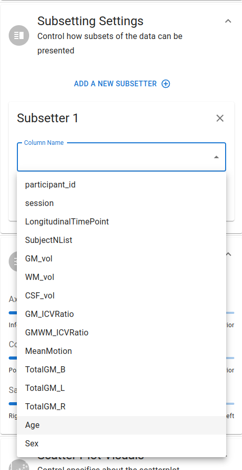
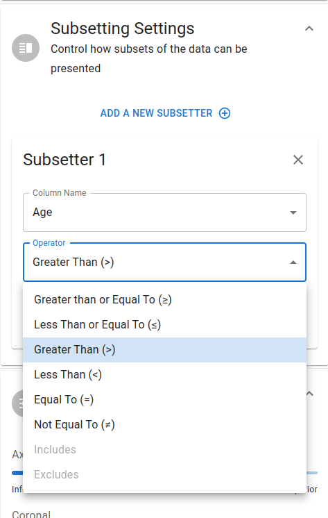
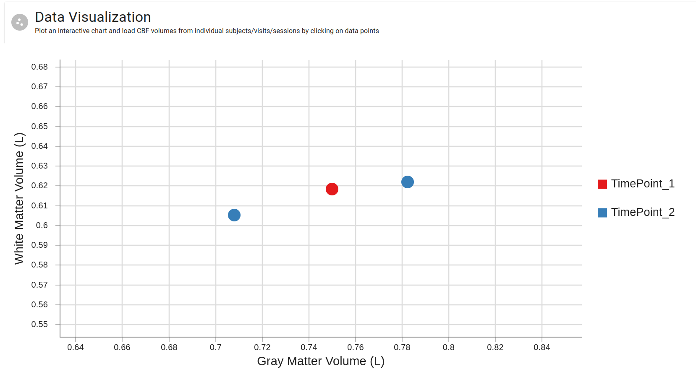

# Data Subsetting

---

In a similar manner to the BIDS editing spreadsheet, this module also allows you to subset your loaded data by several criteria. This is particularly useful for larger datasets for better performance as well as to focus on a specific collection of datapoints with greater focus.

## Subsetting Settings

To create a subsetter, click on the `Add a new Subsetter` button located in the `Subsetting Settings` panel of the `Plot Controls` drawer, and follow the steps below:

1. You will first be prompted to indicate the column by which subsetting criteria will be generated. 

    

2. Depending the the data type of the column, the subsetting operator (i.e. `==`, `!=`, `>`, `<`, `includes`, `excludes`, etc.) options will be loaded in.

    

3. You will then be prompted to enter the value(s) by which the subsetting criteria will be generated. For categorical data, this will be a dropdown menu of the unique values in the column. For continuous data, this will be a numerical input field.

Once all of these are entered, the plot will automatically update to reflect the subsetted data. In the example below, we subsetted the data by `Age` to only include subjects with an age greater than 45.

