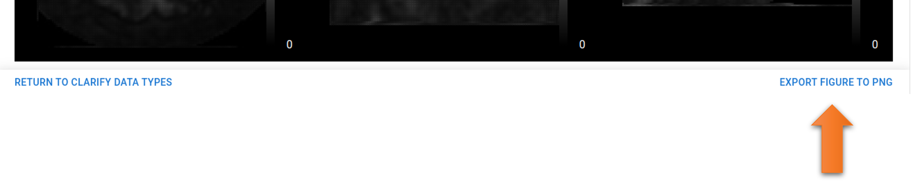

# Exporting Plot and Images

---

Finally, it may be easily missable that there is an option in the lower right corner of the plot, `Export Figure To PNG`, which will allow you to save the plot and the MRI views as a single figure in a PNG file.

A file dialog will open to allow you to specify the location and name of the file, where it will then be saved.

---

# Concluding Remarks

This marks the end of the tutorial. Hopefully it has been a useful introduction to the capabilities of ExploreASL-GUI and the various ways in which it can be used to analyze your ASL data.

For commonly asked questions that may not have been covered in this tutorial, please refer to the [FAQ](../../FAQ/FAQ.md) page.

For contacting the ExploreASL team, please refer to the [Contact](../../Contact.md) page.

---
