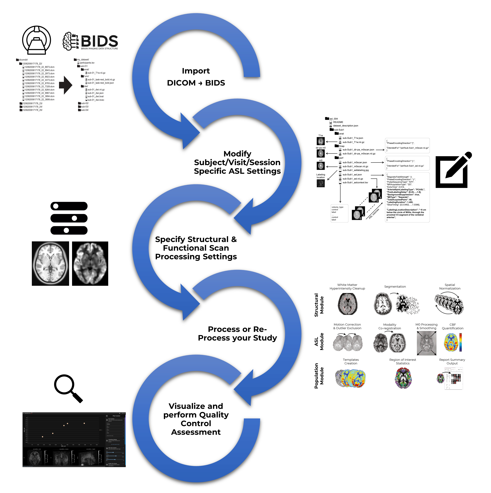

# Home

--------------------------------------------------------------------------------

    

## What is ExploreASL GUI?

This is a graphical user interface (GUI) meant to assist researchers and clinicians in their processing of arterial spin labeling (ASL) acquisitions. It has been developed to be open-source and to support multiple operating systems (Windows, MacOS, Linux) while providing a consistent experience across all platforms.

The software takes on a very "hand-holding" approach as it guides users from start to finish: from the importing of raw DICOM data output from scanners to saving figures of regional cerebral blood flow (rCBF) values on plots & orthovolume slice views.

## What are the goals of this program?

- To provide a performant and user-friendly experience in ASL processing **without requiring any knowledge of programming** or having to write error-prone configuration files.

- To facilitate collaboration and communication between neuroscience groups by having their ASL datasets processed in the same semi-automatic manner that is robust to multicenter and multisequence complications that would otherwise arise. To this end, the program explicitly enforces the novel [**ASL-BIDS extension**](https://www.nature.com/articles/s41597-022-01615-9).

- To minimize the probability of any user error perpetuating into a mistaken data-processing error, thereby reducing the amount of discarded neuroimaging data that enters statistical & machine-learning analyses.

    - Every step of this program features validation of user input.
    - Every validation gives user color & human-readable text feedback as to the nature of the error as well as suggestions for ameliorating said error, where appropriate.

- To promote [reusable components](https://reactjs.org/) and sensible programming logic that may be used by other neuroscience-focused developers, either in writing their own tools _de novo_ or migrating their existing codebase for various purposes, such as "modernizing" the look & feel of their applications.

## Pipeline Overview

The user interface divides the processing of ASL data into 5 sections:

1. DICOM data coming off different MRI scanners and sites must be translated into a consistent [BIDS format](https://bids.neuroimaging.io/).
2. Once imported, a dataset can be validated by loading all ASL BIDS sidecars into an interactive table that provides all expected data grid features (sorting, filtering, etc.). Errors that conflict with the ASL-BIDS standard are highlighted for users and popover feedback is given on fixing issues until the data is validated for ASL-BIDS standard.
3. For any given dataset, global parameters are defined for:
    - The study of interest (i.e. which subjects to process vs. which to ignore, which ExploreASL version to use, etc.)
    - CBF quantification and modeling (i.e. what assumption to make about T2* decay of the blood, single vs dual compartment modeling, etc.)
    - The analysis pipeline itself (i.e. which atlases to use for ROI quantification, choosing which WMH segmentation algorithms, etc.)
    For the latter 2 points above, reasonable defaults are provided.
4. [The ExploreASL pipeline](https://www.sciencedirect.com/science/article/pii/S1053811920305176?via%3Dihub) is executed on the study in a **parallel-processing manner** to make the most out of capable workstations. Multiple cores can be allocated to a particular study and/or multiple studies can be run in parallel and controlled (pause/resume/terminate execution) separately. For any given study, specific steps or entire modules can be re-run at any level (subject, scan, etc.)
5. Users load regional CBF values from a processed study, merge it with any clinical metadata (ancillary data such as demographics, clinical variables, neuropsyche evaluations, etc.) they may have, and plot it interactively alongside the analyzed CBF data. Engaging (clicking) with the plot datapoints loads in point-specific CBF image volumes to allow for streamlined quality-control assessment of entire datasets while viewing the broader data context they encompass.

||
|:--:| 
|*Overview of ExploreASL-GUI Pipeline*|